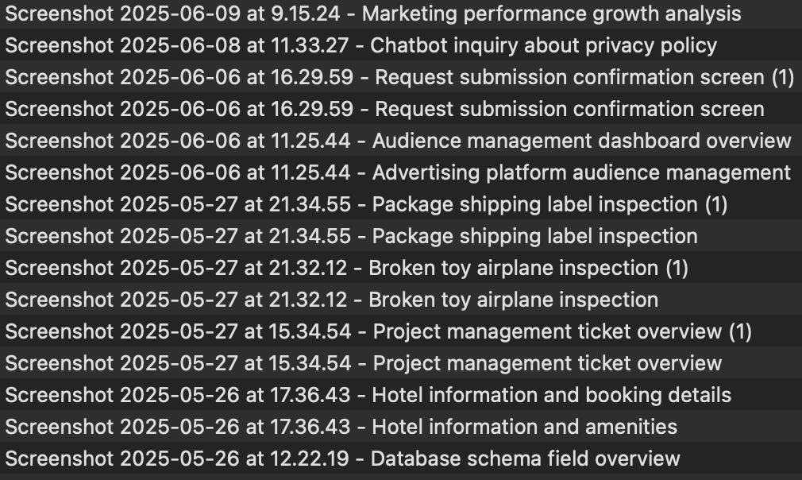

# Screenshot Renaming Tool

An intelligent Python script that automatically renames Mac screenshot files by adding meaningful descriptions using AI vision analysis. Transform cluttered desktop screenshots from generic timestamps into descriptive, searchable filenames.

## Features

- **AI-Powered Analysis**: Uses OpenAI's GPT-4 Vision to analyze screenshot content
- **Smart Descriptions**: Generates concise 4-5 word descriptions of screenshot content  
- **Timestamp Preservation**: Keeps original timestamps for chronological reference
- **Cost Transparency**: Shows estimated costs before processing and tracks actual usage
- **Batch Processing**: Handles multiple screenshots efficiently with rate limiting
- **Comprehensive Logging**: Detailed logs of all operations, errors, and cost tracking
- **Safe Operations**: No data loss - files are renamed, not modified
- **Privacy Focused**: Images are compressed before API transmission
- **Intelligent Naming**: Preserves original filename structure while adding meaningful context

## Example

**Before**: `Screenshot 2025-01-15 at 14.30.22.png`  
**After**: `Screenshot 2025-01-15 at 14.30.22 - Web browser article reading.png`

### Real Results



*Example of processed screenshots showing AI-generated descriptions for various content types including marketing analysis, privacy policies, project management, and more.*

## Requirements

- macOS (tested on Ventura+)
- Python 3.8+
- OpenAI API key with GPT-4 Vision access

## Installation

1. **Clone the repository**
   ```bash
   git clone <repository-url>
   cd screenshots-housekeeping
   ```

2. **Install dependencies**
   ```bash
   pip install -r requirements.txt
   ```

3. **Configure API key**
   ```bash
   # Copy the example environment file
   cp env.example .env
   
   # Edit .env and add your OpenAI API key
   # OPENAI_API_KEY=your_api_key_here
   ```

## Usage

### Interactive Mode (Recommended)
```bash
python3 screenshot_renamer.py
```
This mode will:
- Show you how many screenshots were found
- Display estimated API costs before processing
- Ask for confirmation before proceeding
- Show real-time progress during processing
- Display final summary with actual costs and statistics

### Automatic Mode
```bash
python3 screenshot_renamer.py --auto
```
Processes all screenshots without user interaction (useful for automation). Shows cost estimates and final usage summary.

## Configuration Options

Edit your `.env` file to customize behavior:

```bash
# API Configuration
OPENAI_API_KEY=your_key_here
OPENAI_MODEL=gpt-4-vision-preview  # or other vision-capable model

# Processing Settings
DESCRIPTION_LENGTH=5        # Target number of words in description
BATCH_SIZE=5               # Number of files to process per batch
MAX_RETRIES=3              # API retry attempts per file
API_TIMEOUT=30             # Seconds to wait for API response

# Performance Tuning
MAX_TOKENS=50              # Maximum tokens in API response
```

## Output

### Renamed Files
Screenshots are renamed with the pattern:
```
[Original Filename] - [AI Description].png
```
Example: `Screenshot 2025-01-15 at 14.30.22 - Code editor Python file.png`

**Benefits of this format:**
- Preserves chronological sorting by timestamp
- Maintains clear screenshot identification
- Easy to distinguish original vs processed files
- Descriptive context without losing file history

### Log File
A detailed log is saved to `~/Desktop/screenshot_rename_log.txt` containing:
- Processing summary and statistics
- Cost estimates and actual API usage
- Individual file operations (analysis, rename)
- Error details and troubleshooting information
- Performance metrics and timing data

### Console Output
Real-time feedback showing:
- Files found and cost estimates
- Processing progress with batch updates
- Success/failure for each operation
- Final summary with cost breakdown and statistics

## Privacy & Security

**Data Handling:**
- Images are resized and compressed before API transmission
- Only visual content is sent to OpenAI - no metadata or file paths
- API requests use secure HTTPS connections
- No data is stored by the application

**API Usage:**
- Implements rate limiting and retry logic
- Respects OpenAI's usage policies
- Minimal data transmission through image compression

## Cost Information

### Cost Transparency
The tool provides full transparency about API usage costs:

**Pre-Processing Estimate:**
```
💰 Estimated cost: $0.0345 (3 images)
   • Image processing: $0.0300
   • Token generation: $0.0045
   • Average image size: 2.34 MB
```

**Post-Processing Summary:**
```
💳 Actual cost: $0.0318

Cost Information:
-----------------
Estimated cost: $0.0345
Actual cost: $0.0318
Cost per file: $0.0106
```

### Pricing Model (Approximate)
- **Base image analysis**: ~$0.01 per image
- **Token generation**: ~$0.03 per 1,000 output tokens  
- **Average response**: ~15 tokens (4-5 word descriptions)
- **Typical cost**: $0.01-0.02 per screenshot

### Cost Testing
```bash
python3 test_cost_estimation.py
```
Run this to see cost estimation in action with sample data.

## Error Handling

The tool gracefully handles common issues:
- **API Failures**: Retries with exponential backoff
- **File Permission Issues**: Skips inaccessible files with logging
- **Invalid Images**: Continues processing remaining files
- **Network Timeouts**: Implements robust retry logic
- **Filename Conflicts**: Adds incremental suffixes

## Troubleshooting

**"No screenshot files found"**
- Ensure screenshots follow standard macOS naming: `Screenshot YYYY-MM-DD at HH.MM.SS.png`
- Check that files are located on the desktop

**"API key not found"**
- Verify `.env` file exists and contains `OPENAI_API_KEY=your_key`
- Ensure the API key is valid and has GPT-4 Vision access

**"Permission denied"**
- Check file permissions on desktop directory
- Ensure no files are currently open in other applications

**Poor description quality**
- Adjust `DESCRIPTION_LENGTH` in `.env` for longer/shorter descriptions
- Screenshots with complex or unclear content may get generic descriptions

## Architecture

The application uses a modular design:

- **`config.py`**: Configuration management and environment validation
- **`file_manager.py`**: File system operations and screenshot detection
- **`vision_analyzer.py`**: OpenAI API integration and image analysis
- **`cost_calculator.py`**: API cost estimation and usage tracking
- **`logger.py`**: Logging, progress tracking, and reporting
- **`screenshot_renamer.py`**: Main application controller

### Testing & Validation
- **`test_installation.py`**: Validates environment setup and dependencies
- **`test_cost_estimation.py`**: Demonstrates cost calculation features

## Contributing

This tool was developed as a productivity enhancement for macOS users with cluttered screenshot collections. Contributions for additional features, LLM providers, or platform support are welcome.

## License

See LICENSE file for details.

---

**Note**: This tool requires an active OpenAI API subscription. The built-in cost tracking helps you monitor usage - typical costs are $0.01-0.02 per screenshot for personal use. The tool shows estimated costs before processing and actual costs after completion. 